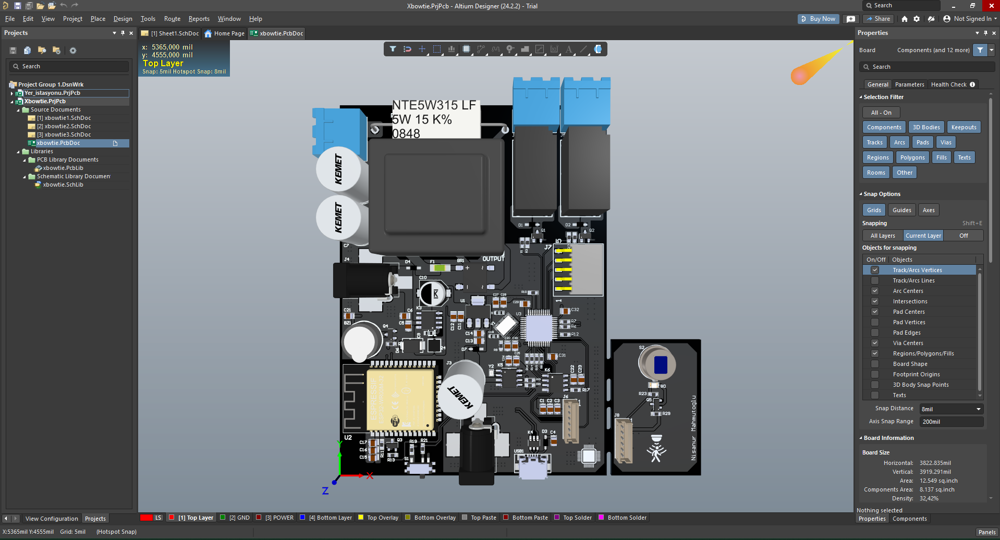
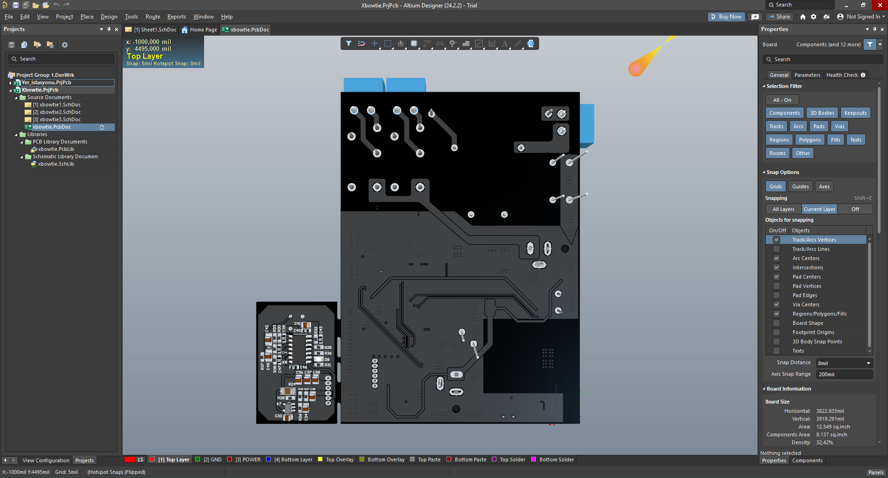
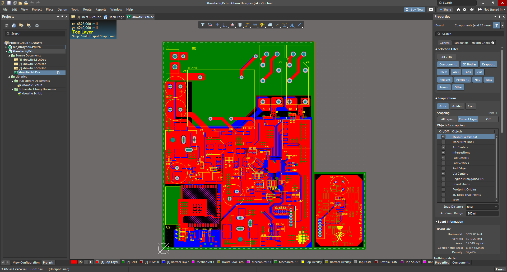
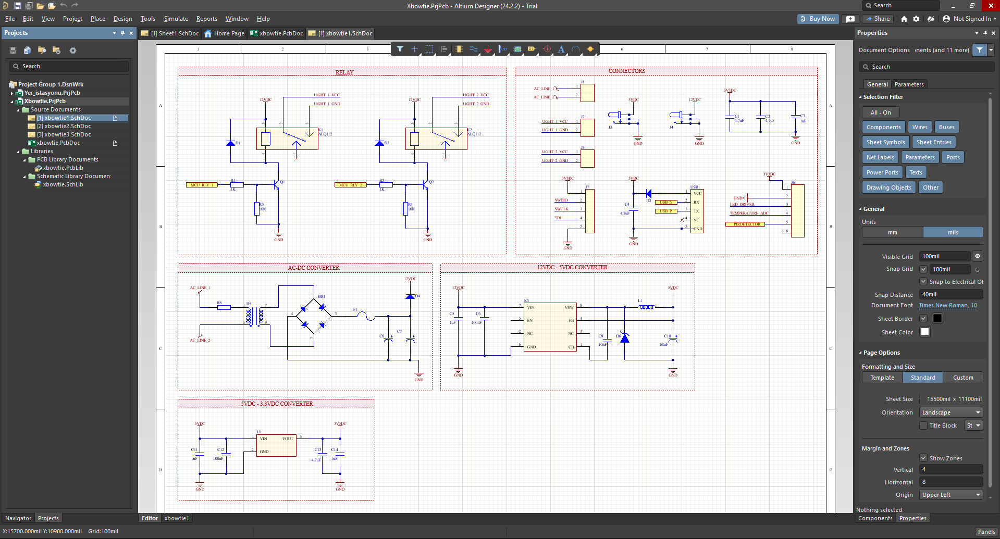
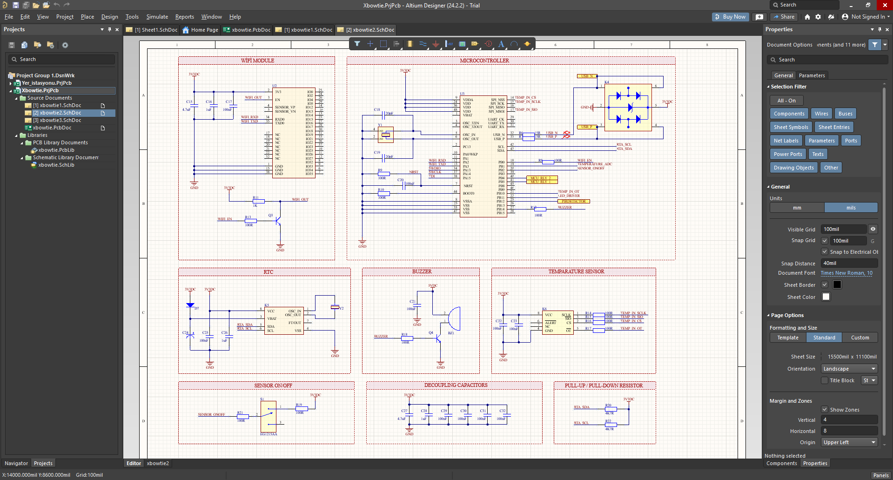
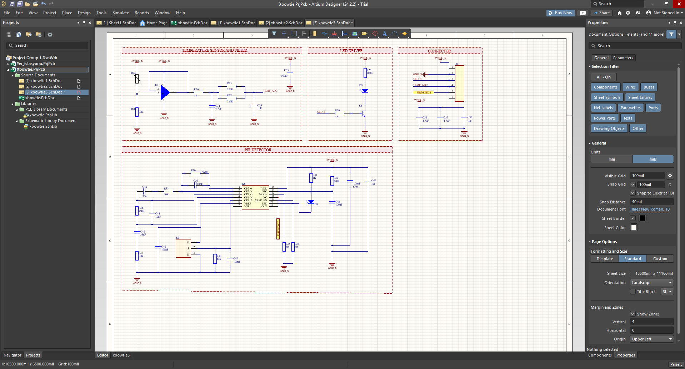

# xBowtie — 220V AC Beslemeli 4 Katmanlı Kontrol Kartı

Bu proje, [Mustafa Berk Aydoğan](https://www.linkedin.com/in/mustafaberkaydogan/) eğitmenliğinde 
xBowtie Türkiye bünyesinde düzenlenen **"PCB Tasarım – Bir Elektronik Kartın Yaşam Döngüsü"** 
eğitimi kapsamında, Altium Designer ile şematikten üretim çıktılarına kadar uçtan uca tasarladığım 
4 katmanlı bir otomasyon/kontrol kartıdır.

## Kartın Özellikleri
- 220V AC 50Hz hattan beslenir; kullanıcıya 12V DC ve 5V DC çıkışlar sunar
- USB arayüzü üzerinden bilgisayara bağlanıp programlanabilir
- RTC (Real-Time Clock) ile gerçek zamanlı sensör veri aktarımı
- PIR hareket sensörü ve sıcaklık sensörü ile ortam verisi takibi
- Röle ve transistörler üzerinden yük/devre sürme işlemleri
- STM32 merkezli kontrol + ESP32 tabanlı Wi-Fi haberleşme entegrasyonu

## Donanım Blokları
| Blok | Açıklama |
|---|---|
| Güç Katı | 230VAC → 12VDC dönüşüm, LM2675 ile 5V step-down, 3.3V LDO regülasyon |
| Kontrol & Haberleşme | STM32, ESP32 Wi-Fi modülü, diferansiyel hat tanımlı USB arayüzü |
| Sensör & Çevre Birimleri | NCS36000 PIR hareket sensörü, RTC, sıcaklık ölçüm katları, izole röle sürücüleri, buzzer/LED |

## Şematik

## Bu Projede Uyguladığım Teknikler
- 4 katmanlı StackUp tasarımı; güç/ground hatları için özel region, plane ve poligon bağlantıları
- DRC (Design Rule Check) ve Health Check aşamalarının hatasız tamamlanması
- Gerber, BOM ve Drill Table üretim çıktılarının hazırlanması, Output Job File ile export
- Varyant ayarları, V-Cut ve Mouse Bite ile seri üretime uygun panelizasyon
- Via tipleri ve tuning işlemleri
- SaturnPCB ile length matching ve impedance matching hesaplamaları; yüksek frekanslı hatların tasarımı
- Şematik/PCB komponentleri için özgün kütüphane ve footprint oluşturma
- Decoupling capacitor, pull-up/pull-down direnç seçimi ve yerleşimi; LTspice ve MATLAB Simulink ile doğrulama

## Not
Bu kart, xBowtie Türkiye'nin düzenlediği eğitim programı kapsamında, eğitmen gözetiminde 
geliştirdiğim bir tasarımdır. Amaç, çok katmanlı, yüksek gerilim ve karma sinyal (analog/dijital) 
içeren profesyonel bir PCB'nin tasarım–üretim sürecini uçtan uca deneyimlemekti. Değerli 
tecrübe aktarımı için [Mustafa Berk Aydoğan](https://www.linkedin.com/in/mustafaberkaydogan/)'a 
teşekkür ederim.
